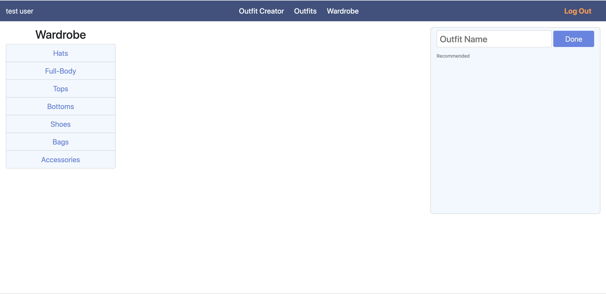

#Home

#Overview & Motivation

Wouldn't it be great if there's some magical AI algorithm to tell you what items in your wardrobe go well together so you can combine them into a compatible outfit, so you can be fashionable with minimum effort? Well it's a bit complicated, since the definition of the word "compatible" is vague. Take a white cowboy hat and blue dress for example, their colors might be compatible, but the styles are so different that it would warrants an arrest from the fashion police.

Our project aims to turn this vague notion of compatibility to our advantage to provide diverse recommendations. By just showing examples of what items looks good together, the computer vision model turn these items into points in multiple high dimensional spaces. Each space represents one way that two items can be compatible. The cowboy hat and the dress will be close to each other in the color space but far from each other in the style space. The spaces can represent color, pattern, material, gender, but it can also represent more complex notions of compatibility that is hard to articulate.

--- 

#Goals & Questions
The goal is to create a content-aware fashion recommendation system that can provide diverse suggestions to encompass different meaning of compatibility that the user might have intended.

With the goal of adopting cutting edge algorithms as the core of our project, we decided to use the neural network architecture presented in a paper published just 4 months ago titled "Learning Similarity Conditions Without Explicit Supervision"

By turning the images into embeddings in multiple spaces using neural network architecture, we hope to make the network learn different encoding of the data that can cluster the clothing items in different ways to represents compatibility.

The main question is whether this method would actually improve the quality of recommendations or not, whether the recommendations would be interpretable and consistent with human expectations.

--- 
#Data Sources

**Polyvore**:
The Polyvore fashion website enables users to create outfits
as compositions of clothing items, each containing rich multi-modal information
such as product images, text descriptions, associated tags, popularity score, and
type information.

An overview of our dataset is below:

* This dataset collected 68,306 outfits with 365,054 items.
* The images are product images, which fashion item images from shopping websites, containing a single product on a plain background
* We do a "disjoint" split into training and testing data. According to [Vasileva et al](https://arxiv.org/pdf/1803.09196.pdf), a graph segmentation algorithm was used to ensure that no garment appears in more
than one split. Each item is a node in the graph, and an edge connects two nodes if the corresponding items appear together in an outfit. 
* This "disjoint" split makes sure that outfits in the test/validation set do not share
any items in common with outfits in the training set (although some items in
the test set may be present in outfits in the validation set). This reduces the data to 32,140 outfits and 175,485 items, 16,995 of which are used for training and 15,145 for testing and validation.
* We generated 1,552,182 triplets from the data. To generate the triplets, we first take 3 items that go together in an outfit, then replace the third item with a random item of same category from a different outfit. This makes the first two item a positive training example (compatible items), while the third item in the triplet is the negative training example (incompatible item)

#Data modeling

## EDA
Below are some plots to gain insights into our dataset

* Histogram of item categories and number of items per outfit in our dataset

* Co-occurency matrix of items and categories. If the cell (item 1, item 2) and (item 2, item 1) has value 10 for example, that means that these two items appear in the same outfit 10 times in the dataset. We also do that to items' fine-grained attributes.

## Initial, attribute-based model
We initially try to give recommendations without visual input as base line. This model does not take into account what the item looks like and does not take into account the rich semantic and visual information that the product images have, they only use textual and categorical attributes of an item to make prediction/recommendation.

We frame it as a multi-label classification problem. We use pairs of items (items that appear together in an outfit) as training set. Our premise is that if we know the category and attributes of one item in the pair, we can predict the other item. Since one item can appear in multiple pairs, and each item can have multiple attributes, this is a multi-label classification problem. Our X was a matrix that has 175 columns. These are the one-hot-encoded category and attributes of the first item. Our predicted variable Y was a matrix also with 175 columns, containing one-hot-encoded category and attributes of the first item.

We used `MultiOutputRandomForestClassifier` as our model, and used Hamming distance as loss function. An example of hamming distance is below:

The final loss on the train dataset was 0.03. Although this seems great, the baseline that we have - creating from predicting 0 for all columns of Y - is 0.065. On the test set, the model had 0.055 loss, but the baseline's loss was already 0.065. Therefore, our model did not improve much compared to the baseline. This is due to the sparsity of the one-hot encoded features/attributes

## Visual content-aware neural network model

We found [a paper by Tan et al](https://arxiv.org/pdf/1908.08589.pdf) published just 4 months ago (August 2019) that uses neural network and attention mechanism/masking to learn implicit similarity conditions (different ways of assesing whether two items are compatible). Details of the model can be found in the paper. Here we just summarize the model and state how it is relevant to our work.

### Neural network model details:

**Top** : We provide triplets as training samples: two items that appear in an outfit together and one item of the same category but does not appear in an outfit as the other two. We feed it in a CNN backbone (Resnet) to transform the images into embeddings of 64 dimensions. 

**Middle**: The embeddings are multiplied element-wise with a vector of shape (4,64), where each row represents a mask/subspace/similarity conditions. Each mask is a vector of (1,64). The 64 dimensions are divided into blocks of 16 element each (64 elements of full embedding divide by 4 mask/subspace). For the first mask, the first block is initialized with random numbers from 0 to 1, and the other blocks are zero. For the second mask, only the second block is non-zero, and so on. The masks can be thought of as an "attention mechanism", or filter over the embedding, only focusing on disjoint parts of the embedding. The final representation is created by linearly combining the masks. The linear combination coefficients, along with the non-zero blocks of each masks are trainable, and changes as each batch of training example is provided. The objective is to create embeddings where the first two items of the triplets are close together, while the third one is far from the first two items in multi-dimensional way. Since we do not explicitly tell/label the condition by which to separate the two items from the third, the network will learn how to separate the items using at least one of the masks. The tradeoff of this unsupervised method is that the conditions learned are usually complex and hard to interpret. 

**Bottom**: At inference time, when the user sends an item as a query, we get the precomputed embedding of that item (4 embeddings each item since we have 4 masks) and then find nearest neighbors to that item. We use masked embedding 1 of item A and compare it with all masked embedding 1 of all other items, and so on. We enforce that the system needs to find at least one neighbor of each category.

### Training details:

- Training was about 10-15 hours per model. We trained about 6 models.
- Trained models with 200k examples and 1 million examples
- The model took about 2 seconds per batch (96 triplets per batch) to train
- We found that the model learned to cluster object types together, even when that information was not provided during training. Therefore, we wrote code to also try with and without pre-trained feature extractor (resnet) with the hope that the model would improve
- Without the pretrained backbone, the model seemed less focused on object type, meaning better results because it can embed dissimilar items closer together
- Accuracy was generally around 90-95%, with accuracy being % of triplets where Y was closer to X than Z
- The model took around 4 or 5 epochs to converge, generally, though some were trained for 10+ epochs.
- When training with 1m examples, the model converged after one epoch

## Final embeddings of each subspace

Using a sample subset of data, we use t-sne and UMAP to reduce the embeddings to 3 dimensions and visualize them in Tensorboard:

### Mask 1

### Mask 2

### Mask 3

### Mask 4

### Combined weighted embedding of all 4 subspaces

## Sample query

Query item:

Recommendations:

We see that the styles of the results between the subspaces are very different. This is good since we can provide diverse recommendations.

# Design

## Functionalities and sketches
Based on our observations of current fashion recommender app and our discussion, we wanted our app to be able to recommend items based on items the users choose from a wardrobe, and hence be able to create outfits based on those recommendations and make changes afterwards.

Each person on our team made sketches to show the core functionalities and flow of our app, and we finally settled with this version of sketch below:

We decided to make our app to have three main pages: a wardrobe page that displays all the items in our database, an outfit creator page that helps the users to choose items from their current wardrobe to create sets of outfits based on the recommendations made by our algorithm and a saved outfits page where the users could have a preview of the outfits they created, and be able to change or delete them.

## First version
The first version of UI design we implemented by bootstrap studio is as follows:

1.	**Wardrobe Page**

Originally, we were thinking about having both an upload feature/grabbing items from other website and browsing from the wardrobe feature. But since our database has a huge set of items already and given the time limit, we decided to eliminate the uploading feature for now. Another feature that we were thinking about is the search feature, but since each item in our database is named by its ID but not name, we decided to use categorizing feature instead to reduce the amount of time users browsing through the wardrobe.

At this stage, all the features including the texts and images were hard-coded.

2. **Outfit Creator Page**:

At this stage, the outfit creator page consisted of only two components: a template of outfit where the items would be moved to once they are selected by users, and a column of recommended items where each row lined up with the same category of item on the left, so it would be easier for users to compare and contrast.

3.	**Saved Outfits Page**:

At this stage, the saved outfits page is very simple, basically it showed a complete set of outfit created by users in the creator outfits page. The design here only shows one set of outfit in the vertical direction, but it could have more sets on the right. Later, we decided to present the outfits in a horizontal direction instead of vertical.

## Second version
For the wardrobe page, we populated the images of items from the database and used accordions to expand/collapse the items so it does not look that overwhelming to the users, and we used dropdown menus to dynamically filter the subcategories within the broad categories. A multi-select feature was also implemented, so it would capture the items selected by the users and save them and pass them to the backend for further uses in the outfits creator page.

For the outfit creators page, three more features were implemented:
The accordions on the left side help to categorize items in the wardrobe and so it would be easier for the users to filter and find the items. Add buttons were created in the middle section to add items to the corresponding position. Carousel features were implemented on the right side. Since our algorithm would return multiple items at a time, this feature would allow users to skim through the whole series of recommended items without losing track of the items they have seen previously. Also, users can click on items and they would appear in the middle section, creating the shape of an outfit

## Third version
In the third version, the backend and the frontend were fully linked together and all the functionalities worked. 

First of all, a simple login and signup page were implemented so users could have outfits saved and it improved security. 

Next, once users log into their account, they will be lead to an empty wardrobe page (since we don’t want users to be overwhelmed by the endless number of items in our huge database). By clicking the “randomize” button, a few hundreds of items will be randomly generated from the database.

Now users could have an overview of the items in this randomized wardrobe and be ready to create their own outfit.

Clicking “Outfit Creator” on the navigation bar, users would be directed to the page below. On the left are all the items in the wardrobe and users could scroll down to pick items they like. Once they click on one item, it would be added automatically to a corresponding row in the middle. On the right side, recommendations would be generated automatically once an item is chosen and users could also add the recommended items to their outfits. By clicking again on the items, users could remove the items they don’t want to be in the outfit any more.  

We decided to get rid of the carousel because we want to display more than one recommended item at any time. Also, we felt like it was too restricting to have only one item per category in the saved outfits, since the user might want to save multiple items of hats and then choose which one they want to wear the day of based on other factors (weather, formal or informal occasions etc).

After users name the outfit they created and click the “submit” button, they would be directed to the outfits page, they could also delete the outfit.

## Final version
In our final version, we fine tuned our app design a bit, including changing the theme color and adding some features as final touches.

We categorized the items in the wardrobe by type so it would be easier for users to navigate. We also make it so that the "x" button to delete clothing item from wardrobe only appear when we hover the mouse over it. 

Similarly, we also categorized items from the wardrobe on the outfit creator page. On top of that, we added scrolling accordions so users don’t have to scroll down all the way to the bottom to find the item they are interested in. Noted that in the example below, we have some items with grey borders and some with blue border. The ones with grey borders are items already in users’ wardrobe, whereas the ones with blue borders are items users could buy from retail stores and people could add these to their own wardrobe as well. Also, as new recommended items are added, we do automatic scroll to the right of each category row as a visual cue for the user.

Lastly, “Wardrobe” and the default “Outfit Name” were added to the top of each section so users could know immediately which are those for. 

#Logistics

We followed roughly the below timeline

  **Week 1 (11/5 - 11/12):**
  
  	- EDA, visualization with dimensionality reduction, clustering
  	- Baseline recommendation model working with only textual data/attributes (Multi-label Classification problem)
  
  **Week 2 (11/12 - 11/19):**
  
  	- Try out models for incorporating image/visual data into the recommendation
  	- Pick one model to fine tune and pursue further
  	- Create mockup of the final web app. Start implementing web app UI/layout using Bootstrap
  
  **Week 3 (11/19 - 11/26)**
  
  - Finish modeling, Iteration 1
  - Focus on front end
    
  **Week 4 (11/26 - 12/3)**
  
  - Buffer week, Iteration 2
  - Focus on backend

  **Week 5 (12/10 - 12/17)**
  - Connect front end with back end (Iteration 3)
  - Deploy app
  - Write report, presentation
  
#Further work

- NLP integration for textual features of clothing description. Multi-modal recommendation.

- Do recommendation of multiple items. Focusing on outfit compatibility rather

- Increase the number of masks.

- Compare different representations of compatibility.

- Segmentation of real world clothing and apply the model to these images to compare performance
